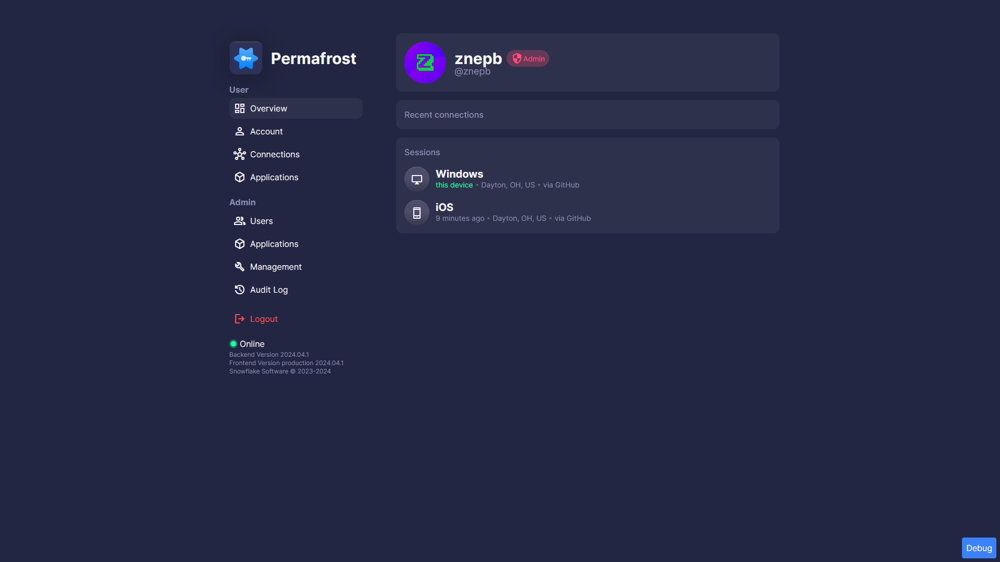
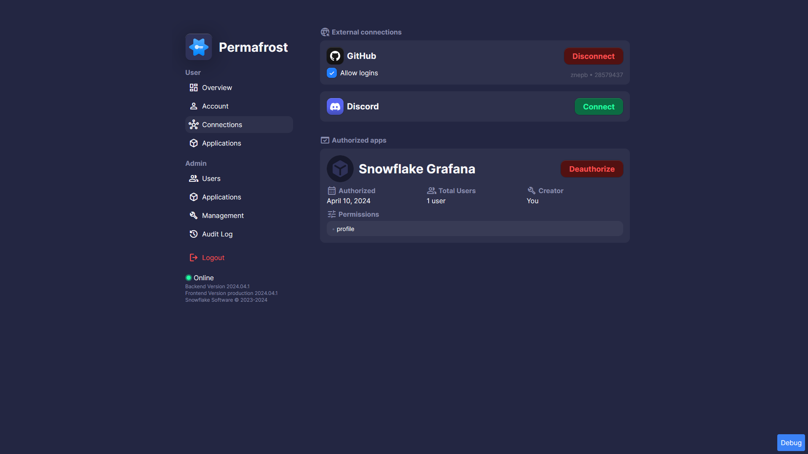
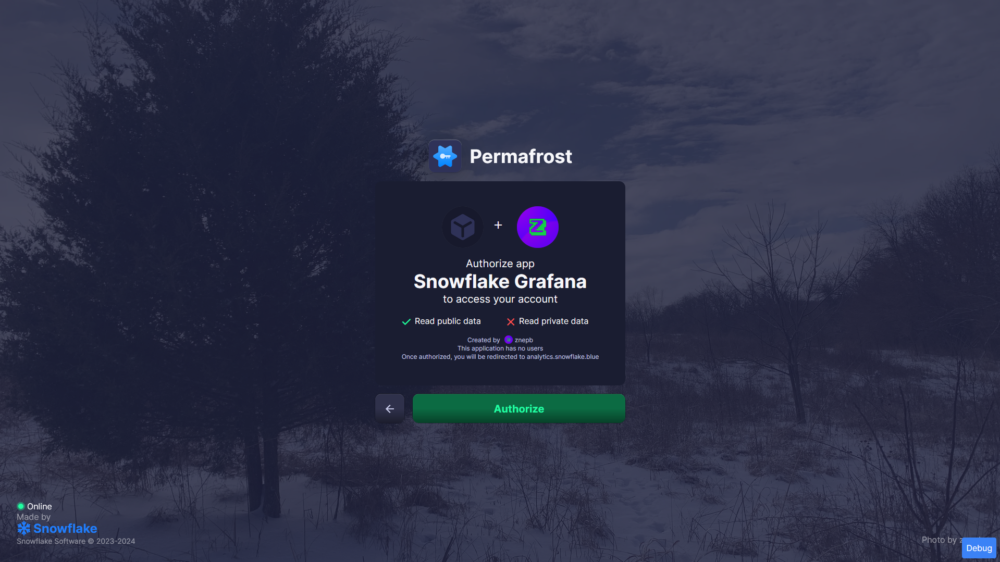
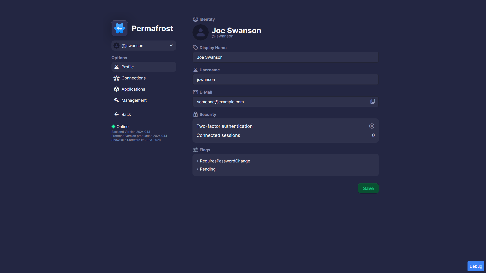
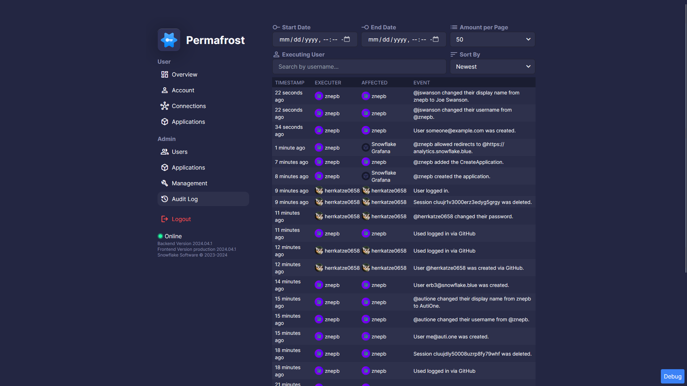

<p align="center">
  <picture>
    <source media="(prefers-color-scheme: dark)" srcset="./.github/assets/header-darkmode.png">
    <source media="(prefers-color-scheme: light)" srcset="./.github/assets/header-lightmode.png">
    
  </picture>
</p>

---

## What is Permafrost

Permafrost is an identity provider that aims to be simple. It has many integrations, ranging from NginX to Discord.

## Installation

Visit the docs

## Screenshots



<details>
 <summary>Click to see more screenshots!</summary>
  
  
  
  
</details>

## Deploying

```bash
cp docker-compose.example.yml docker-compose.yml
docker compose up -d
```
